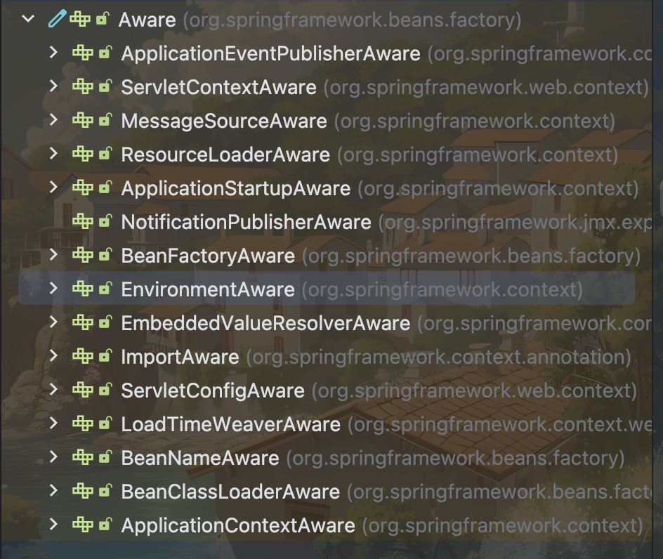
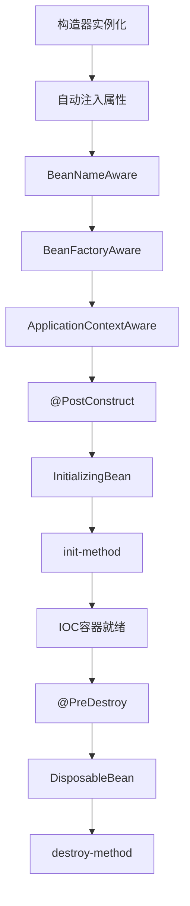

# 容器

组件:具有一定功能的对象
容器:管理组件(创建获取保存销毁)

- 组件特性
  1. 名字
  2. 类型
  3. 作用域
  4. 对象

>tomcat就是管理servlet的容器

Ioc:控制反转,控制资源,反转获取方式
DI:依赖注入,通过组件的依赖关系,通过构造器等方式注入赋值

## 注册

在springboot启动时会调用run方法,该方法会返回一个ioc容器(ApplicationContext)

- 注册组件
  - @Bean(name = ""):Bean组件
  - @Configuration:配置类,分类管理类
  - @Component:mvc分层注解的统称
  - @ComponentScan(basePackage = ""):组件扫描
  - @Import(Class<?> class):注册不是自己包内的类为组件
  - @Scope(scopeName = ""):组件的作用域(单实例非单实例)
  - @Lazy:单例模式下懒加载,在容器启动过程中不创建对象,调用时才创建
  - FactoryBean:Bean制造工厂,当bean对象比较复杂的时候可以实现FactoryBean接口来创建bean
  - @Conditional:条件注册,需要创建一个条件类,实现Conditional接口

- 获取组件
  - 名字(注解上的)
  - 类型
  - 类型+名字

>组件不唯一会报错

在容器启动过程中就会创建组件对象,并且组件的对象是单实例的,多次调用只会调去到同一个对象

## 注入

- 注入组件
  - @Autowired:自动注入组件,调用getBean方法,优先按照类型注入
    - 如果类型只有一个,直接注入
    - 如果找到多个,按照变量名去找,按照名字注入
    - 可以使用List<?>把全部类型拿过来
    - 可以使用Map<String,?>把类型和名字拿过来
  - @Qualifier:精确直接指定名字注入
  - @Primary:默认注入组件
  - @Resource:jdk规范的自动注入,通用
  - 构造器注入:当ioc容器需要注册组件的时候,就会自动把构造器中需要的组件注入
  - @Value:动态注入字段,${key}:从配置文件中注入,#{SpEL}:Spring表达式,可以看成java代码
  - @PropertySource("classpath表达式"):指定当前类的配置文件
  - @Profile("标识"):实际上为条件注入,可以在配置文件中使用spring.profile.active="标识"来激活bean

>spring提供了获取资源的工具类:ResourceUtils
>在没有springboot以前,需要自己使用xml配置bean和ioc容器

感知接口Aware,他的实现类方便获取系统相关信息,只要实现了接口,spring就会自动注入信息

## 生命周期

在@Bean()中可以定义initMethod和destoryMethod方法

BeanPostProcessor:后置处理器机制,能够查看修改bean,构造和注入器之后,@PostConstruct之前

生命周期全图:

